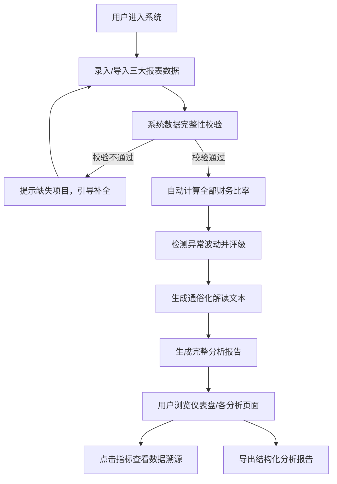

## 1. 产品概述

财务报表分析系统是一款面向非财务背景企业管理者的智能分析工具，通过对资产负债表、利润表、现金流量表三大报表的结构化深度分析，自动识别关键指标异常波动，计算核心财务比率，并用通俗易懂的语言阐释财务含义。所有分析结论均标注数据来源与计算过程，确保专业性、可追溯性，杜绝无依据预测。

- **核心价值**：降低财务分析门槛，让管理者快速理解企业真实财务状况
- **目标用户**：企业中高层管理者、创业者、投资人（非财务专业背景）
- **产品定位**：专业可靠、通俗易懂、可追溯的财务分析助手

## 2. 核心功能

### 2.1 功能模块清单
1. **数据中心**：三大报表数据录入（手动输入/模板导入）、多期数据对比、数据校验
2. **报表概览**：资产负债表、利润表、现金流量表结构化展示，关键指标高亮
3. **财务健康仪表盘**：核心KPI卡片、趋势迷你图、健康度评分
4. **异常波动检测**：自动识别环比/同比异常波动指标，标注异常等级与原因
5. **财务比率分析**：偿债能力、盈利能力、运营效率、成长能力四大类比率计算
6. **通俗化解读**：每个指标配"人话翻译"，用生活化类比解释财务含义
7. **数据溯源**：每个结论标注数据来源（报表项目、行号）、计算公式、计算过程
8. **分析报告导出**：生成结构化分析报告（含所有溯源信息）

### 2.2 页面详情

| 页面名称 | 模块名称 | 功能描述 |
|---------|---------|----------|
| 首页仪表盘 | 顶部导航 | 系统标题、报表切换、报告导出按钮 |
| 首页仪表盘 | 企业信息卡 | 企业名称、分析期间、数据完整性检查状态 |
| 首页仪表盘 | 财务健康总评 | 综合评分、等级标签、四大维度雷达图 |
| 首页仪表盘 | 核心KPI卡片组 | 营收、净利润、资产总额、现金流净额等8项核心指标，含同比环比 |
| 首页仪表盘 | 异常预警面板 | 异常指标列表，按严重程度排序，点击跳转详情 |
| 报表详情页 | 报表切换Tab | 资产负债表/利润表/现金流量表切换 |
| 报表详情页 | 报表数据表 | 标准财务报表格式，支持多期并排对比，异常项高亮 |
| 报表详情页 | 项目注释面板 | 悬浮/点击显示项目通俗解释、数据来源标注 |
| 比率分析页 | 维度分类Tab | 偿债/盈利/运营/成长四大分类 |
| 比率分析页 | 比率卡片网格 | 每个比率显示：数值、行业参考、计算过程、通俗解读 |
| 比率分析页 | 趋势图表 | 选择比率查看多期趋势折线图 |
| 异常分析页 | 波动筛选器 | 按异常等级、报表类型、波动幅度筛选 |
| 异常分析页 | 波动详情表 | 指标名称、本期值、上期值、变动率、异常等级、可能原因提示 |
| 分析报告页 | 报告结构导航 | 目录式导航，点击跳转对应章节 |
| 分析报告页 | 报告正文区 | 按"总评-报表分析-比率分析-异常分析-建议"结构生成 |
| 分析报告页 | 溯源附录 | 所有计算过程、数据来源、公式说明的完整附录 |

## 3. 核心流程

**用户主流程描述**：
1. 用户首次使用时，通过表单或模板录入资产负债表、利润表、现金流量表数据（支持至少2期对比数据）
2. 系统自动校验数据完整性（如资产=负债+权益平衡校验），缺失或不平衡时给出明确提示
3. 后台自动执行：计算全部预设财务比率 → 对比多期数据识别异常波动 → 为每个指标生成通俗化解读
4. 用户首页即可看到财务健康总评、核心KPI、异常预警三大视图
5. 用户可深入各页面查看细节，点击任意分析结论均可展开查看完整数据来源和计算过程
6. 最终可导出包含全部溯源信息的结构化分析报告

## 4. 用户界面设计

### 4.1 设计风格
- **主色调**：深邃藏蓝 `#1e3a5f`（专业、信任）+ 墨绿 `#2d6a4f`（增长、稳健）
- **辅助色**：警示橙 `#e07b39`（异常提示）、危险红 `#c92a2a`（严重异常）、中性灰 `#495057`
- **背景**：浅灰渐变底 `#f8f9fa` → `#e9ecef`，卡片纯白加柔和阴影
- **字体**：标题使用 Lora（衬线，典雅专业），正文使用 Noto Sans SC（无衬线，中文易读）
- **按钮风格**：圆角 8px，主按钮渐变填充，悬停时轻微上浮阴影加深
- **布局风格**：顶部导航 + 左侧目录（报告页），主体采用卡片式栅格布局
- **数据溯源设计**：点击卡片右上角 `ⓘ` 图标，滑出侧栏显示公式源码、计算过程、数据来源单元格

### 4.2 页面设计概览

| 页面名称 | 模块名称 | UI设计要点 |
|---------|---------|----------|
| 首页仪表盘 | 财务健康总评 | 圆形进度条评分 + 四维雷达图叠加，动画填充加载 |
| 首页仪表盘 | 核心KPI卡片 | 2×4网格，每张卡显示指标名/数值/同比箭头/迷你趋势线，异常时边框变色 |
| 首页仪表盘 | 异常预警面板 | 左红右黄渐变左侧边条，严重等级用🔴🟠🟡图标标注 |
| 报表详情页 | 报表数据表 | 标准会计格式（千分位、负数红括号），多期对比时差异列高亮 |
| 比率分析页 | 比率卡片 | 三色状态条（优/中/差），折叠式"计算过程"和"通俗解读"面板 |
| 分析报告页 | 报告正文 | 仿Word排版，关键结论旁标注上标编号，点击跳转附录溯源 |

### 4.3 响应式
- **桌面优先**：1280px以上完整布局，1920px优化展示
- **平板适配**：1024px栅格自动重排为2列，侧边栏转为顶部折叠菜单
- **移动端**：768px以下KPI卡片单列，数据表横向滚动，简化图表

### 4.4 动效设计
- 页面加载：卡片依次淡入上浮（stagger 80ms）
- 数据更新：数字滚动动画（1.2秒从旧值过渡到新值）
- 异常提示：脉冲红框呼吸动画
- 溯源面板：右侧滑入（200ms ease-out）
