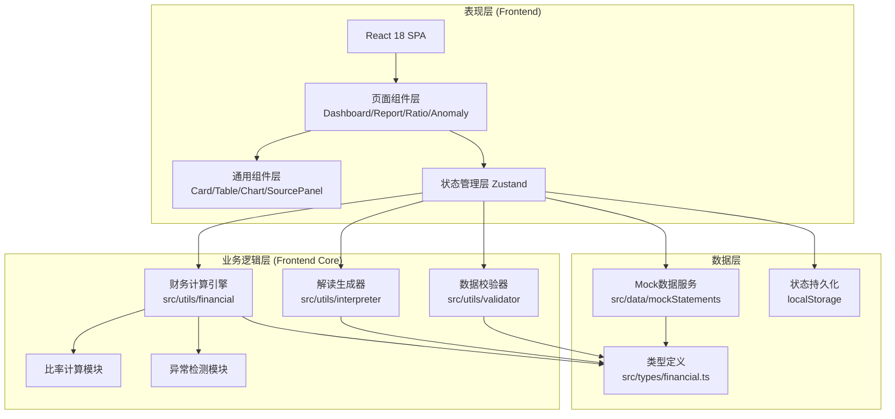

## 1. 架构设计



## 2. 技术说明

- **前端框架**：React@18 + TypeScript@5 + Vite@5
- **样式方案**：Tailwind CSS@3 + CSS Variables（主题系统）
- **路由**：React Router DOM@6
- **状态管理**：Zustand@4（财务数据全局store）
- **图表库**：Recharts@2（趋势图、雷达图、迷你图）
- **图标**：Lucide React
- **后端**：无（纯前端应用，数据存localStorage，预置示例Mock数据）
- **数据格式**：JSON结构存储三大报表，支持导出/导入JSON

## 3. 路由定义

| 路由路径 | 页面组件 | 功能说明 |
|---------|---------|----------|
| `/` | DashboardPage | 首页仪表盘：总评、KPI、异常预警 |
| `/statements/:type` | StatementsPage | 报表详情页，type: balance-sheet / income / cash-flow |
| `/ratios` | RatiosPage | 财务比率分析页，四大维度分类展示 |
| `/anomalies` | AnomaliesPage | 异常波动分析页，筛选+详情表 |
| `/report` | ReportPage | 完整分析报告页，含目录+溯源附录 |
| `/data` | DataEntryPage | 数据录入/导入/导出页 |

## 4. 数据模型

### 4.1 核心数据结构

```typescript
// 三大报表通用基础结构
interface FinancialStatement {
  period: string;           // 期间标识，如 "2025年度" / "2025Q1"
  companyName: string;
  currency: string;         // 币种：CNY / USD
  unit: string;             // 单位：元 / 万元 / 亿元
}

// 资产负债表
interface BalanceSheet extends FinancialStatement {
  // 资产
  cash: number;                          // 货币资金
  accountsReceivable: number;            // 应收账款
  inventory: number;                     // 存货
  otherCurrentAssets: number;            // 其他流动资产
  totalCurrentAssets: number;            // 流动资产合计
  fixedAssetsNet: number;                // 固定资产净额
  intangibleAssets: number;              // 无形资产
  otherNonCurrentAssets: number;         // 其他非流动资产
  totalNonCurrentAssets: number;         // 非流动资产合计
  totalAssets: number;                   // 资产总计
  
  // 负债
  shortTermBorrowings: number;           // 短期借款
  accountsPayable: number;               // 应付账款
  otherCurrentLiabilities: number;       // 其他流动负债
  totalCurrentLiabilities: number;       // 流动负债合计
  longTermBorrowings: number;            // 长期借款
  otherNonCurrentLiabilities: number;    // 其他非流动负债
  totalNonCurrentLiabilities: number;    // 非流动负债合计
  totalLiabilities: number;              // 负债总计
  
  // 所有者权益
  paidInCapital: number;                 // 实收资本
  retainedEarnings: number;              // 未分配利润
  otherEquity: number;                   // 其他权益
  totalEquity: number;                   // 所有者权益合计
  totalLiabilitiesAndEquity: number;     // 负债和权益总计
}

// 利润表
interface IncomeStatement extends FinancialStatement {
  revenue: number;                       // 营业收入
  costOfRevenue: number;                 // 营业成本
  grossProfit: number;                   // 毛利润
  sellingExpenses: number;               // 销售费用
  adminExpenses: number;                 // 管理费用
  financialExpenses: number;             // 财务费用
  rndExpenses: number;                   // 研发费用
  operatingProfit: number;               // 营业利润
  nonOperatingIncome: number;            // 营业外收入
  nonOperatingExpenses: number;          // 营业外支出
  totalProfit: number;                   // 利润总额
  incomeTaxExpense: number;              // 所得税费用
  netProfit: number;                     // 净利润
  netProfitToParent: number;             // 归母净利润
}

// 现金流量表
interface CashFlowStatement extends FinancialStatement {
  operatingCashInflow: number;           // 经营活动现金流入
  operatingCashOutflow: number;          // 经营活动现金流出
  operatingNetCashFlow: number;          // 经营活动净现金流
  
  investingCashInflow: number;           // 投资活动现金流入
  investingCashOutflow: number;          // 投资活动现金流出
  investingNetCashFlow: number;          // 投资活动净现金流
  
  financingCashInflow: number;           // 筹资活动现金流入
  financingCashOutflow: number;          // 筹资活动现金流出
  financingNetCashFlow: number;          // 筹资活动净现金流
  
  netIncreaseInCash: number;             // 现金净增加额
  beginningCashBalance: number;          // 期初现金余额
  endingCashBalance: number;             // 期末现金余额
}

// 财务比率计算结果
interface FinancialRatio {
  id: string;
  name: string;                          // 比率名称
  category: 'solvency' | 'profitability' | 'efficiency' | 'growth';
  value: number | null;                  // 计算结果
  unit: string;                          // 单位：% / 倍 / 次
  benchmark: {                           // 行业参考值
    good: number;
    warning: number;
    danger: number;
  } | null;
  formula: string;                       // 公式字符串（展示用）
  calculation: {                         // 计算过程（溯源用）
    numerator: { label: string; value: number; source: string };
    denominator: { label: string; value: number; source: string };
    steps: string[];
  } | null;
  interpretation: {                      // 通俗解读
    level: 'excellent' | 'good' | 'normal' | 'warning' | 'danger';
    summary: string;                     // 一句话总结
    detail: string;                      // 详细通俗解释
    analogy: string;                     // 生活化类比
  };
}

// 异常波动记录
interface AnomalyRecord {
  id: string;
  indicatorName: string;
  statementType: 'balance' | 'income' | 'cashflow' | 'ratio';
  fieldKey: string;
  currentPeriod: string;
  previousPeriod: string;
  currentValue: number;
  previousValue: number;
  changeAmount: number;
  changeRate: number;                    // 百分比
  severity: 'critical' | 'warning' | 'notice';
  threshold: number;                     // 触发阈值
  possibleReasons: string[];             // 可能原因提示（非预测，仅列举常见原因）
  sourceTrace: string;                   // 数据来源追溯
}
```

### 4.2 财务比率清单（共20项）

**偿债能力（5项）**：
- 流动比率 = 流动资产 / 流动负债（参考 ≥2）
- 速动比率 = (流动资产 - 存货) / 流动负债（参考 ≥1）
- 资产负债率 = 总负债 / 总资产（参考 ≤60%）
- 权益乘数 = 总资产 / 所有者权益
- 利息保障倍数 = 息税前利润 / 利息费用（参考 ≥3）

**盈利能力（6项）**：
- 毛利率 = (营收 - 营业成本) / 营收
- 净利率 = 净利润 / 营收
- ROE（净资产收益率）= 净利润 / 平均所有者权益
- ROA（总资产收益率）= 净利润 / 平均总资产
- 营业利润率 = 营业利润 / 营收
- 费用率 = (销售+管理+财务+研发费用) / 营收

**运营效率（5项）**：
- 应收账款周转率 = 营收 / 平均应收账款
- 应收账款周转天数 = 365 / 应收周转率
- 存货周转率 = 营业成本 / 平均存货
- 存货周转天数 = 365 / 存货周转率
- 总资产周转率 = 营收 / 平均总资产

**成长能力（4项）**：
- 营收增长率 = (本期营收 - 上期营收) / 上期营收
- 净利润增长率 = (本期净利润 - 上期净利润) / 上期净利润
- 总资产增长率 = (期末总资产 - 期初总资产) / 期初总资产
- 净资产增长率 = (期末净资产 - 期初净资产) / 期初净资产

### 4.3 异常检测规则

- **严重异常**（Critical）：单期变动率 ≥ ±50%
- **警告异常**（Warning）：单期变动率 ≥ ±30% 且 < ±50%
- **关注提示**（Notice）：单期变动率 ≥ ±15% 且 < ±30%
- 特殊规则：资产负债率超过 70% 触发警告，超过 85% 触发严重；流动比率 < 1 触发警告

## 5. 目录结构规划

```
src/
├── types/
│   └── financial.ts          # 全部类型定义
├── data/
│   └── mockStatements.ts     # 预置示例企业数据（2-3期）
├── utils/
│   ├── financial/
│   │   ├── calculator.ts     # 比率计算引擎
│   │   ├── anomaly.ts        # 异常检测模块
│   │   └── validator.ts      # 数据校验（平衡检查等）
│   ├── interpreter/
│   │   ├── ratioInterpreter.ts # 比率通俗解读生成
│   │   └── reportGenerator.ts  # 分析报告生成
│   └── format.ts             # 数字格式化工具
├── store/
│   └── useFinancialStore.ts  # Zustand全局状态
├── components/
│   ├── layout/               # 布局组件（Header, Sidebar等）
│   ├── dashboard/            # 仪表盘专用组件
│   ├── statements/           # 报表展示组件
│   ├── ratios/               # 比率卡片等组件
│   ├── anomalies/            # 异常展示组件
│   ├── charts/               # Recharts封装组件
│   └── common/               # 通用组件（Source溯源面板等）
├── pages/
│   ├── DashboardPage.tsx
│   ├── StatementsPage.tsx
│   ├── RatiosPage.tsx
│   ├── AnomaliesPage.tsx
│   ├── ReportPage.tsx
│   └── DataEntryPage.tsx
├── router/
│   └── index.tsx
├── App.tsx
└── main.tsx
```

## 6. 关键技术决策说明

1. **纯前端架构**：本系统定位为分析工具，不涉及敏感数据的集中存储，用户数据保存在本地浏览器 localStorage，支持 JSON 导入/导出，兼顾隐私与便携性。

2. **计算引擎与UI分离**：所有财务计算逻辑独立封装在 `utils/financial/`，纯函数无副作用，便于单元测试与逻辑审计。每个计算函数返回结果时附带 `calculation` 溯源对象（分子、分母、来源、分步算式）。

3. **解读生成策略**：采用"规则模板 + 上下文填充"模式。每个比率预设 3-5 档解读模板（优秀/良好/一般/警告/危险），根据计算结果匹配档位后动态插入数值与类比，避免无依据的自由生成。

4. **异常可追溯性**：系统不做原因推断，仅列举常见可能原因（如"存货大幅增加常见于：备货旺季、滞销积压、会计政策变更等"），并明确标注"以上为可能性列举，不构成判断结论"，严格遵循不做无依据预测的要求。
